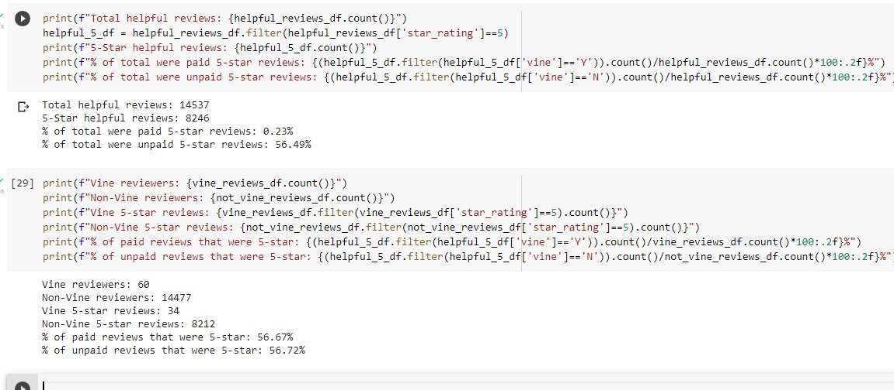

# Amazon_Vine_Analysis

## Overview

Here, we examine amazon product review data to identify possible bias.

Amazon Vine is a program by which manufacturers and publishers pay to have their products reviewed, and in turn Amazon Vine members receive free products.  We will look at the numbers to see if these reviews are biased, skewing the overall ratings of products.  The data set we are looking at here is for musical instruments.

## Results

First, we filter down the dataset to only include common products and helpful reviews. This means reviews which earned over 20 votes and at least a 50% ratio of helpful votes to total votes. The next step is to calculate total reviews, total 5-star reviews, and the percentage of total reviews which are paid vs. unpaid. We also calculate the total reviews, the 5-star reviews, and the 5-star percentages amongst each group, paid vs. unpaid.

The counts and percentages are shown here:

To recap:
- Total Vine reviewers: 60
- Total non-Vine reviewers: 14477
- 5-star Vine reviews: 34
- 5-star Non-Vine reviews: 8212
- % of paid that were 5-star: 56.67%
- % of unpaid that were 5-star: 56.72%

## Summary

Judging by these numbers, more than half of the reviews were very positive (5-stars).  The percentage of these that were part of the vine program was a mere 0.23% of total reviews.  This is insignificant compared to the 5-star unpaid reviews, which account for 56.49% of total reviews.

In addition, the percentages of positive reviews within each group is both about 56.7%.

These numbers suggest that the Vine reviews are not biased, and even if they were, they would not significantly influence the rating data.

Another interesting analysis may be to look into helpful votes between unpaid and paid reviews.  Maybe the small number of Vine reviews helped influence and shape those who ended up buying the product.  Maybe reading the Vine reviews helped shape others' opinions. A disproportionate number of helpful votes among paid reviews may indicate larger influence.
